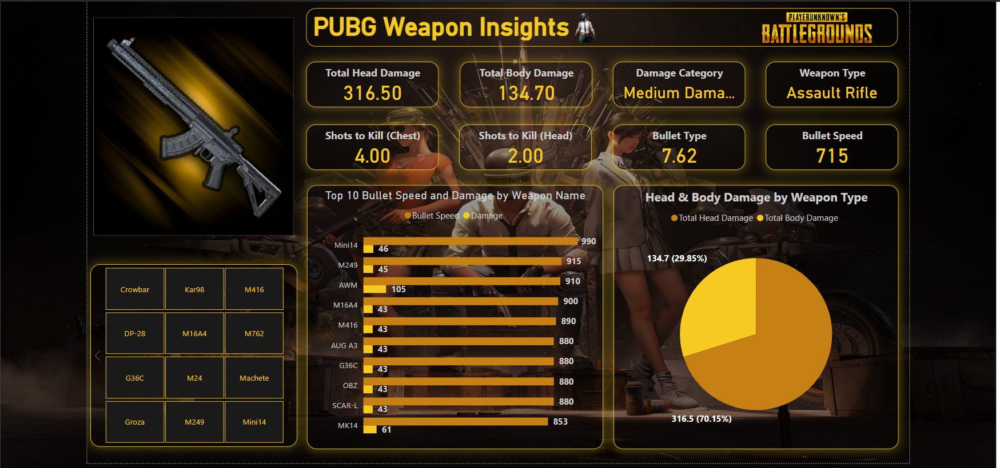

# PUBG Weapon Insights

# Description

This project aims to assist players in understanding the strengths and weaknesses of various weapons, offering insights into damage categories, weapon types, and a comparison of the top 10 weapons based on bullet speed and damage. With clear visualizations and user-friendly navigation, this tool is designed to enhance gameplay strategy and decision-making.

# Tools
Power Query :data cleaning
DAX: For data preparation, calculations, and measures.
Power BI: For interactive dashboards and data visualization.

# Key Features:
Performance Metrics:

- Total Head Damage

Displays the maximum head damage dealt by the weapon (e.g., 316.50).

- Total Body Damage

Indicates the total damage dealt to the body (e.g., 134.70).

- Damage Category

Classifies the weapon based on its damage type (e.g., Medium Damage).

- Weapon Type

Specifies the category of the weapon (e.g., Assault Rifle).

- Shots to Kill (Chest)

Shows the number of chest shots required to eliminate a target (e.g., 4 shots).

- Shots to Kill (Head)

Highlights the number of headshots needed to take down an opponent (e.g., 2 shots).

- Bullet Type

Provides the type of bullet used by the weapon (e.g., 7.62).

- Bullet Speed

Displays the speed of the bullet in meters per second (e.g., 715).

# Visualizations

- Damage Distribution Pie Chart:

Head vs. Body Damage:

Visual representation of the total head and body damage.

Example: Head damage (70.15%), Body damage (29.85%).

- Top 10 Weapons Bar Chart:

Comparison Metrics:

Showcases bullet speed and damage for the top-performing weapons.

Example: Weapons like Mini14, M416, and AWM ranked by performance.

- Weapon Stats Panel:

Interactive Dashboard:

Users can explore key weapon stats like shots to kill, bullet type, and speed.

- Weapon Categorization Blocks:
Dynamic Navigation:
Organized blocks for quick access to weapons (e.g., Assault Rifles, Snipers).

- Detailed Weapon View:
  
Focused Display:
Highlight individual weapon details such as damage type, category, and bullet properties.

- User-Friendly Interface:

Interactive Filtering:

Switch between weapon types or stats using an intuitive UI design.

# Conclusion
This PUBG Weapon Insights dashboard offers a comprehensive and interactive way to analyze weapon performance, empowering gamers to make data-driven decisions. By visualizing key metrics such as damage, shots to kill, bullet type, and speed, players can optimize their gameplay strategies effectively.

With intuitive charts, detailed weapon statistics, and interactive navigation, this tool serves as an essential resource for both casual players and competitive gamers aiming to improve their performance on the battleground.

Feedback and suggestions are welcome to further enhance this project! 😊

